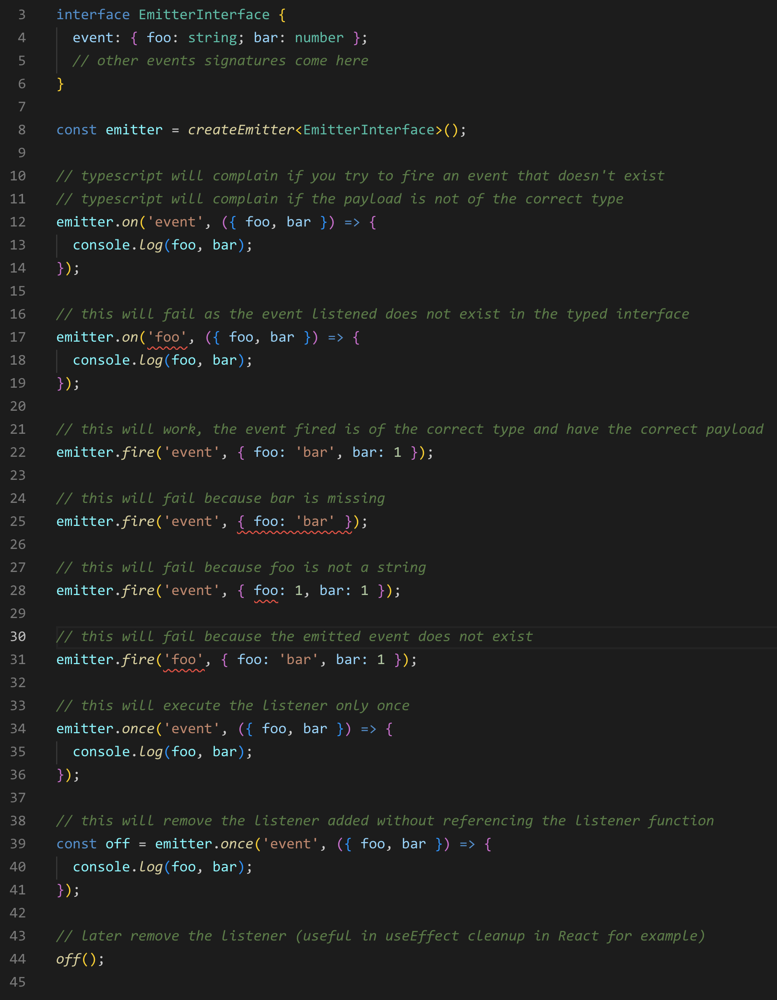

# simple-typed-emitter

Very simple typed event emitter with a simplified api interface, inspired by [strict-event-emitter-types](https://github.com/bterlson/strict-event-emitter-types)

## Features

- Very simple api, `on`, `once`, `off`, `fire` and `clear` methods
- The `on`, `once`, `off` and `fire` methods are typed, so you can be sure that the event you are listening to is of the type you expect and receive the correct payload
- The `on`, `once` methods returns a function that you can use to remove the listener without having to pass the event name and the listener function

## Installation

```bash
npm install simple-typed-emitter
```

## Usage

```ts
// create an interface for your emitter events
interface EmitterInterface {
  event: { foo: string; bar: number };
  // other events signatures come here
}

const emitter = createEmitter<EmitterInterface>();

// typescript will complain if you try to fire an event that doesn't exist
// typescript will complain if the payload is not of the correct type
emitter.on('event', ({ foo, bar }) => {
  console.log(foo, bar);
});

// this will fail as the event listened does not exist in the typed interface
emitter.on('foo', ({ foo, bar }) => {
  console.log(foo, bar);
});

// this will work, the event fired is of the correct type and have the correct payload
emitter.fire('event', { foo: 'bar', bar: 1 });

// this will fail because bar is missing
emitter.fire('event', { foo: 'bar' });

// this will fail because foo is not a string
emitter.fire('event', { foo: 1, bar: 1 });

// this will fail because the emitted event does not exist
emitter.fire('foo', { foo: 'bar', bar: 1 });

// this will execute the listener only once
emitter.once('event', ({ foo, bar }) => {
  console.log(foo, bar);
});

// this will remove the listener added without referencing the listener function
const off = emitter.once('event', ({ foo, bar }) => {
  console.log(foo, bar);
});

// later remove the listener (useful in useEffect cleanup in React for example)
off();

```



## License

MIT